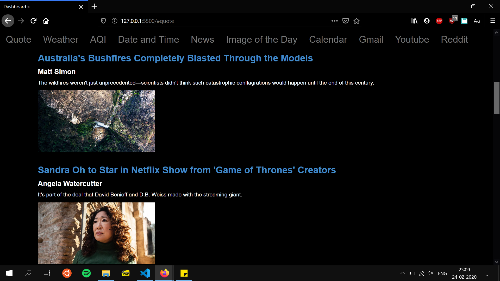
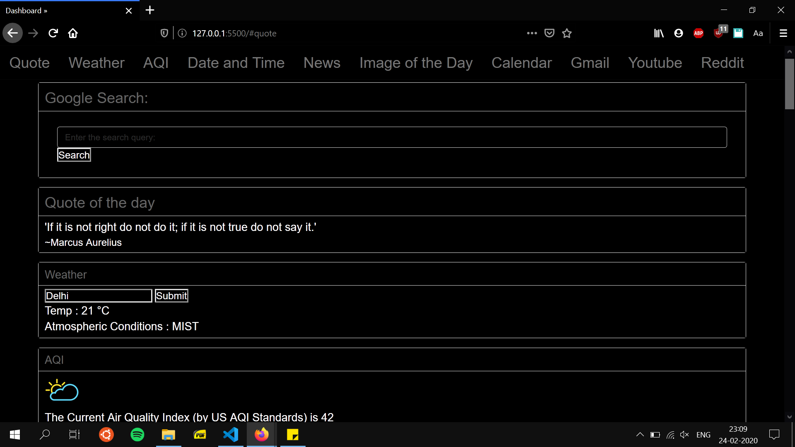

# QuickDash, The world at a glance

QuickDash, your world at a glance!
QuickDash is a modern looking, modular and informative dashboard which gives you access to the content you need and the sites you use the most, all at one place.
Weather Forecast and Air Quality Index powered by AirVisual give you an overview of the day awaiting you. Quick, Short news articles fetched regularly from reliable sources keep you updated while quick shortcuts to Google, Youtube and Reddit make Dashboard the hub you really need.

QuickDash aims at grouping together tasks performed by us multiple times a day, all at one place and neatly presented.

Future plans for QuickDash include support for both dark and light (in the works!) themes, support for more complex and powerful APIs and greater flexibility and modularity, utilising the React framework.

## Steps to run:

1) Start live server on VS Code (after opening the directory) or any other alternative.
2) Profit !!

## Public APIs used:

## 1) Google Calendar
https://developers.google.com/calendar/

Implemented a To-Do/Goals List along with a list of upcoming events using the api, due to requirement of credit card data, the calendar api does not work presently.

## 2) Air Visual
https://www.airvisual.com/air-pollution-data-api 

Real Time Pollution Levels and Air Quality Index Data 

## 3) Currents
https://currentsapi.services/en

To display latest news articles from aggregated sources, along with a brief description of the headlines.

## 4) Quote Garden
https://pprathameshmore.github.io/QuoteGarden/

To presenting randomised quotes, a new quote on each refresh. 

## 5) Lorem Picsum
https://picsum.photos

Random greyscale aesthetic photographs to go along with the dark theme.

## 6) This Person Does not Exist
ThisPersonDoesnotExist.com

Creating User Profiles and Images

## 7) OpenWeatherMap
openweathermap.org 

Extracting Live Weather Data for entered city and displaying it on the dashboard.

## 8) World Time API
worldtimeapi.org

Getting World Time Data for various time zones, with an option to use users location data to automatically set the date and time for the dashboard web app.

## 9) Keen Dashboards
Flexbox based UI Template for the dashboard, used as a starter kit.

---
## Screenshots:

